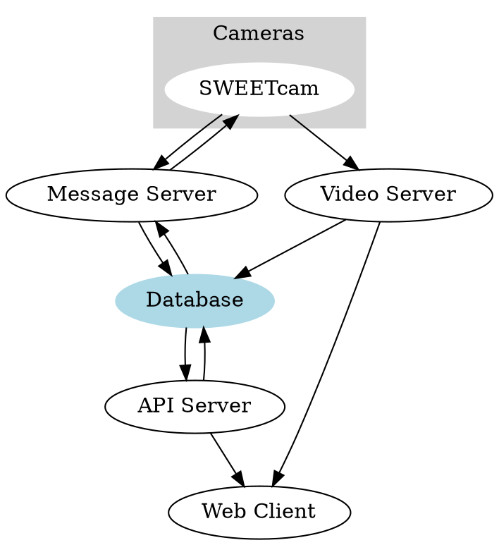
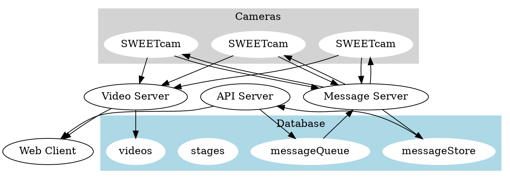

```dot*
digraph G {

    subgraph cluster_cams {
    	style=filled;
		color=lightgrey;
		node [style=filled,color=white];
		
		cam1[label="SWEETcam"];
				
		label = "Cameras";
	}
    
        # Camera connections
    cam1 -> messageServer;
    cam1 -> videoServer;
    messageServer -> cam1;
    
    db [style=filled,color=lightblue,label="Database"];


    
    # Servers
    apiServer[label="API Server"];
    videoServer[label="Video Server"];
    messageServer[label="Message Server"];

    
    messageServer -> db;
    db -> messageServer;


    # Video
    videoServer->webClient;
    videoServer->db

    apiServer->db;
    apiServer->webClient;
    db->apiServer;    

    webClient[label="Web Client"];
}
```

# Complete System Diagram

```dot*
digraph G {

    subgraph cluster_cams {
    	style=filled;
		color=lightgrey;
		node [style=filled,color=white];
		
		cam1[label="SWEETcam"];
		cam2[label="SWEETcam"];
		cam3[label="SWEETcam"];
		
		label = "Cameras";
	}
    
    subgraph cluster_db {
		style=filled;
		color=lightblue;
		node [style=filled,color=white];
		
		messageStore;
		messageQueue;
		stages;
		videos;
		
		label = "Database";
	}

    # Camera connections
    cam1 -> messageServer;
    cam1 -> videoServer;
    messageServer -> cam1;
    cam2 -> messageServer;
    cam2 -> videoServer;
    messageServer -> cam2;
    cam3 -> messageServer;
    cam3 -> videoServer;
    messageServer -> cam3;
    
    # Servers
    apiServer[label="API Server"];
    videoServer[label="Video Server"];
    messageServer[label="Message Server"];

    
    messageServer -> messageStore;
    messageQueue -> messageServer;


    # Video
    videoServer->videos
    videoServer->webClient;

    apiServer->messageQueue;
    apiServer->webClient;
    messageStore->apiServer;    

    webClient[label="Web Client"];
}
```
